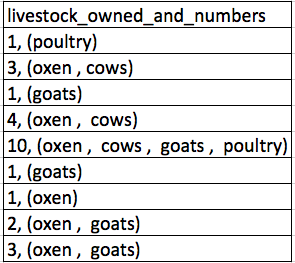

## Data formatting problems

The most common mistake made is treating spreadsheet programs like lab notebooks, that is,
relying on context, notes in the margin,
spatial layout of data and fields to convey information. As humans, we
can (usually) interpret these things, but computers don't view information the same way, and
unless we explain to the computer what every single thing means (and
that can be hard!), it will not be able to see how our data fit
together.

Using the power of computers, we can manage and analyze data in much more
effective and faster ways, but to use that power, we have to set up
our data for the computer to be able to understand it (and computers are very
literal).

This is why it’s extremely important to set up well-formatted
tables from the outset - before you even start entering data from
your very first preliminary experiment. It can make it easier or harder
to work with your data throughout your analysis, so it's worth
thinking about when you're doing your data entry or setting up your
experiment. 

The best layouts/formats (as well as software and interfaces) for data entry and data analysis might be different. It is important to take this into account, and ideally automate the conversion from one to another.
{: .note}

## Some best practices

### Keep track of your analyses

When you're working with spreadsheets, during data clean up or analyses, it's
very easy to end up with a spreadsheet that looks very different from the one
you started with. In order to be able to reproduce your analyses or figure out
what you did when Reviewer #3 asks for a different analysis, you should

1. Create a new file or tab with your cleaned or analyzed data. Don't modify the original dataset, or you will never know where you started!
2. Keep track of the steps you took in your clean up or analysis. You should track these steps as you would any step in an experiment. You can do this in another text file, or a good option is to create a new tab in your spreadsheet with your notes. This way the notes and data stay together.

### Structure data effectively

The cardinal rules of using spreadsheet programs for data:

1. Put all your variables in columns - the thing you're measuring,
   like 'weight' or 'temperature'.
2. Put each observation in its own row.
3. Don't combine multiple pieces of information in one
   cell. Sometimes it just seems like one thing, but think if that's
   the only way you'll want to be able to use or sort that data.
4. Leave the raw data raw - don't change it!
5. Export the cleaned data to a text-based format like CSV (comma-separated values) format. This
   ensures that anyone can use the data, and is required by
   most data repositories.

Take a look at this screenshot of some collected data (we'll talk more about the dataset and the context later).

The problem is that number of livestock and type of livestock are in
the same field. So, if the researchers wanted to
look at the average number of livestock owned, or the average number of each type
of livestock,
it would be hard to do this using this data setup. If instead we put the count
of each type of livestock in its own column, this would make analysis
much easier.

The rule of thumb, when setting up a datasheet, is that each
variable (in this case, each type of livestock) should have its own column,
each observation should have its own row, and each cell should contain only a
single value. Thus, the example above should look like this:

Notice that this now allows us to make statements about the number of each type of
animal that a farmer owns, while still allowing us to say things about the
total number of livestock. All we need to do is sum the values in each row to
find a total. We'll be learning how to do this computationally and reproducibly
later in this workshop.

## Activity

We're going to take a messy version of a dataset for this workshop and describe how we would clean it up.

### Workshop Data 

The data used in these lessons are taken from interviews of farmers in two
countries in eastern sub-Saharan Africa (Mozambique and Tanzania). These
interviews were conducted between November 2016 and June 2017 and probed
household features (e.g. construction materials used, number of household
members), agricultural practices (e.g. water usage), and assets (e.g. number
and types of livestock). They also recorded the dates and locations of
each interview.

This is a real dataset, however, it has been simplified for this workshop. If
you're interested in exploring the full dataset further, you can download
it from Figshare and work with it using exactly the same tools we’ll learn
about today.

For more information about the dataset and to download it from Figshare, check
out the [Social Sciences workshop data
page](http://www.datacarpentry.org/socialsci-workshop/data).
{: .note}

Step 1
{: .label .label-step}
Download the [messy data](https://ndownloader.figshare.com/files/11502824).
{: .step}

Step 2
{: .label .label-step}
Open up the data in a spreadsheet program.
{: .step}

Step 3
{: .label .label-step}
Notice that there are two tabs. Two researchers conducted the interviews, one in Mozambique and the other in Tanzania. They both structured their data tables in a different way. Now, you're the person in charge of this project and you want to be able to start analyzing the data. **What problems do you see in the way the data is currently organized?**
{: .step}
