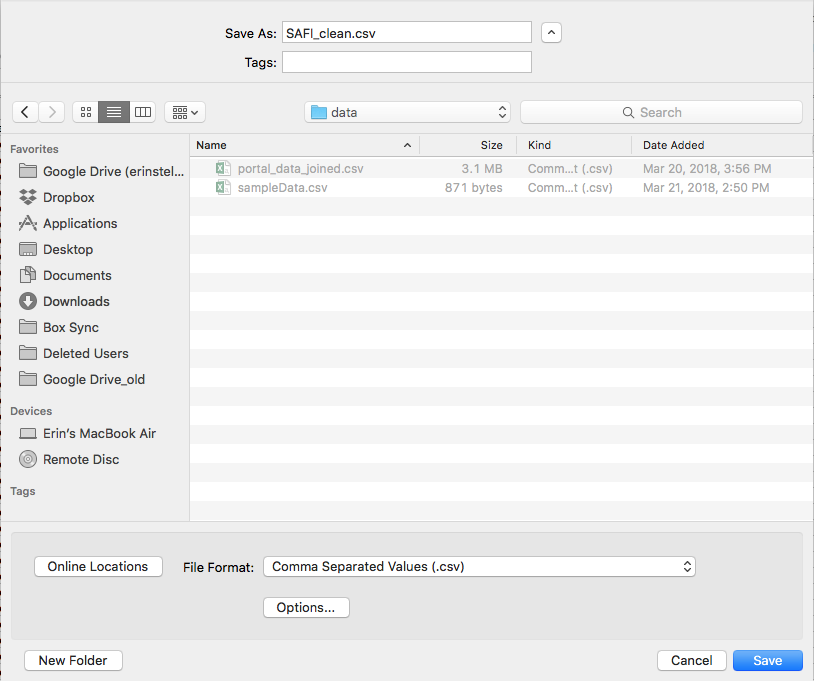

Storing the data you're going to work with for your analyses in Excel
default file format (`*.xls` or `*.xlsx` - depending on the Excel
version) isn't a good idea. Why?

* Because it is a proprietary format, and it is possible that in
  the future, technology won’t exist (or will become sufficiently
  rare) to make it inconvenient, if not impossible, to open the file.
  
* Other spreadsheet software may not be able to open files
  saved in a proprietary Excel format.

* Different versions of Excel may handle data
  differently, leading to inconsistencies.

* Finally, more journals and grant agencies are requiring you
  to deposit your data in a data repository, and most of them don't
  accept Excel format. It needs to be in one of the formats
  discussed below.
  
* The above points also apply to other formats such as open data formats used by LibreOffice. These formats are not static and do not get parsed the same way by different software packages.

As an example of inconsistencies in data storage, do you remember how we talked about how Excel stores dates earlier? It turns out that 
there are multiple defaults for different versions of the software, and you can switch between them all. So, say you’re
compiling Excel-stored data from multiple sources. There’s dates in each file- Excel interprets them as their own internally consistent
serial numbers. When you combine the data, Excel will take the serial number from the place you’re importing it from, and interpret it
using the rule set for the version of Excel you’re using. Essentially, you could be adding errors to your data, and it wouldn’t
necessarily be flagged by any data cleaning methods if your ranges overlap.

Storing data in a universal, open, and static format will help deal with this problem. Try tab-delimited (tab separated values
or TSV) or comma-delimited (comma separated values or CSV). CSV files are plain text files where the columns are separated by commas,
hence 'comma separated values' or CSV. The advantage of a CSV file over an Excel/SPSS/etc. file is that we can open and read a CSV file
using just about any software, including plain text editors like TextEdit or NotePad. 
Data in a CSV file can also be easily imported into other formats and
environments, such as SQLite and R. We're not tied to a certain version of a certain expensive program when we work with CSV files, so
it's a
good format to work with for maximum portability and endurance. Most spreadsheet programs can save to delimited text formats like CSV
easily, although they may give you a warning during the file export.

To save a file you have opened in Excel in CSV format:

1. From the top menu select `File` and `Save as`.
2. In the `Format` field, from the list, select `Comma Separated Values` (`*.csv`).
3. Double check the file name and the location where you want to save it and hit `Save`.

An important note for backwards compatibility: you can open CSV files in Excel!

A note on R and `xls`
There are R packages that can read `xls` files (as well as Google spreadsheets). It is even possible to access different worksheets in the `xls` documents. However, because these packages parse data tables from proprietary and non-static software, there is no guarantee that they will continue to work on new versions of Excel. Exporting your data to CSV or TSV format is much safer and more reproducible.
{: .note}

### What to do when your data contain commas
In some datasets, the data values themselves may include commas (,). In that case, you need to make sure that the commas are properly escaped when saving the file. Otherwise, the software which you use (including Excel) will most likely incorrectly display the data in columns. This is because the commas which are a part of the data values will be interpreted as delimiters. 

If you are working with data that contains commas, the fields should be enclosed with double quotes. The spreadsheet software should do the right thing ([LibreOffice](https://www.libreoffice.org/download/download/) provides comprehensive options to import and export CSV files). However, it is always a good idea to double check that the file you are exporting can be read in correctly. For more of a discussion on data formats and potential issues with commas within datasets see [the Ecology Spreadsheets lesson discussion page](http://www.datacarpentry.org/spreadsheet-ecology-lesson/discuss/).
